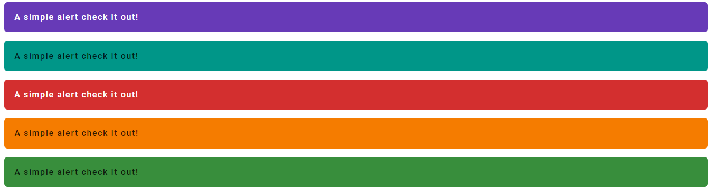
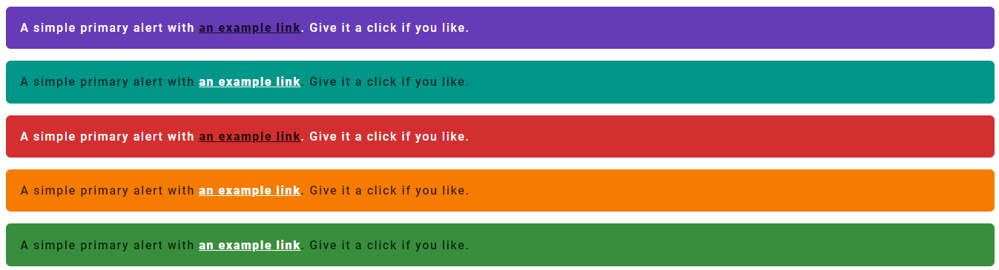
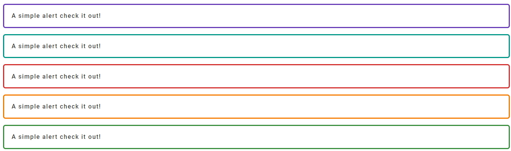
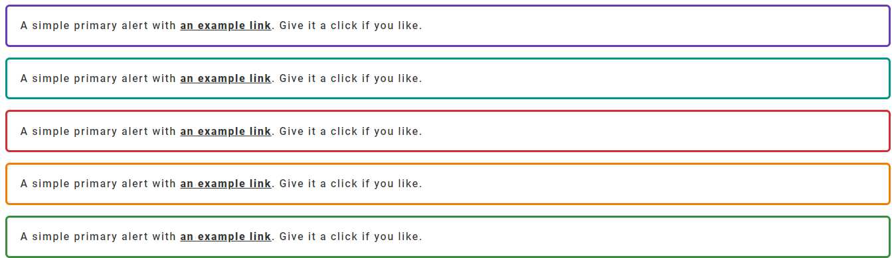

# Alerts

There are diffrent types of alerts:

1. [Alert](#alert)
1. [Outlined alert](#outlined-alert)

### Installation

```bash
npm install flash-css
```

### Styles

```scss
@import 'src/scss/components/alerts/index';
```

## Alert



```html
<div class="alert">A simple alert check it out!</div>

<div class="alert-secondary">A simple alert check it out!</div>

<div class="alert-error">A simple alert check it out!</div>

<div class="alert-warning">A simple alert check it out!</div>

<div class="alert-done">A simple alert check it out!</div>
```

<b>Alert with link example</b>



```html
<div class="alert">
  A simple primary alert with 
  <a href="#" class="alert-link">an example link</a>. Give it a click if you like.
</div>
    
<div class="alert-secondary">
  A simple primary alert with
  <a href="#" class="alert-link">an example link<a>. Give it a click if you like.
</div>

<div class="alert-error">
  A simple primary alert with <a href="#" class="alert-link">an example link</a>. Give it a click if you like.
</div>

<div class="alert-warning">
  A simple primary alert with <a href="#" class="alert-link">an example link</a>. Give it a click if you like.
</div>

<div class="alert-done">
  A simple primary alert with <a href="#" class="alert-link">an example link</a>. Give it a click if you like.
</div>
```

## Outlined alert



```html
<div class="alert-outlined">A simple alert check it out!</div>

<div class="alert-outlined-secondary">A simple alert check it out!</div>

<div class="alert-outlined-error">A simple alert check it out!</div>

<div class="alert-outlined-warning">A simple alert check it out!</div>

<div class="alert-outlined-done">A simple alert check it out!</div>
```

<b>Outlined alert with link example.</b>



```html
<div class="alert-outlined">
  A simple primary alert with <a href="#" class="alert-link">an example link<a>. Give it a click if you like.
</div>

<div class="alert-outlined-secondary">
  A simple primary alert with <a href="#" class="alert-link">an example link</a>. Give it a click if you like.
</div>

<div class="alert-outlined-error">
  A simple primary alert with <a href="#" class="alert-link">an example link</a>. Give it a click if you like.
</div>

<div class="alert-outlined-warning">
  A simple primary alert with <a href="#" class="alert-link">an example link</a>. Give it a click if you like.
</div>

<div class="alert-outlined-done">
  A simple primary alert with <a href="#" class="alert-link">an example link</a>. Give it a click if you like.
</div>

```