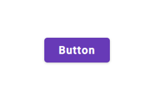
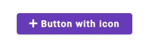
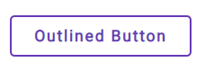
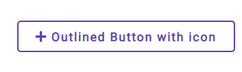
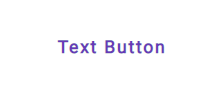
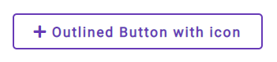
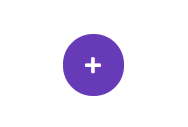
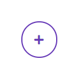
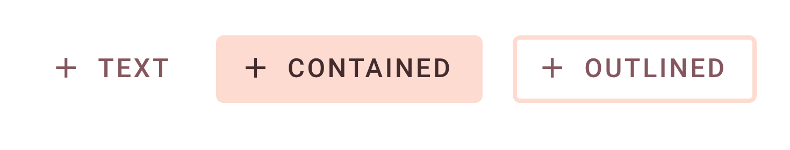

# Buttons

There are diffrent types of buttons:

1. [Button](#button)
1. [Outlined button](#outlined-button)
1. [Text button](#text-button)
1. [Icon button](#icon-button)
1. [Outlined icon button](#outlinde-icon-button)


### Installation

```bash
npm install flash-css
```

### Styles

```scss
@import 'src/scss/components/buttons/index';
```

## Button



```html
<button class="button">
  <span>Button</span> 
</button>
```

<b>Button with icon example</b>



```html
<button class="button">
  <span class="fas fa-plus"></span>
  <span>Button with icon</span>
</button>
```

## Outlined button



```html
<button class="outlined-button">
  <span>Outlined Button</span>
</button>
```

<b>Outlined button with icon example</b>



```html
<button class="outlined-button">
<span class="fas fa-plus"></span>
<span>Outlined Button with icon</span>
</button>
```
## Text button



```html
<button class="text-button">
  <span>Text Button</span>
</button>  
```

<b>Text button with icon example</b>



```html
<button class="text-button">
  <span class="fas fa-plus"></span>
  <span>Text Button with icon</span>
</button>
```


## Icon button



```html    
<button class="icon-button">
  <span class="fas fa-plus"></span>
</button>
```

## Outlinde icon button



```html    
<button class="outlined-icon-button">
  <span class="fas fa-plus"></span>
</button>
```


### Disabled

To disable a button, add the `disabled` attribute directly to the `<button>`.
Disabled buttons cannot be interacted with and have no visual interaction effect.

Like so:

```html
<button class="button" disabled>
  Button
</button>
```

**NOTE** You'r free to surround the text with **<span>** tag you can also put the text without any surroun.

## Button theming example

The following example shows text, Button, and outlined button types with Theming.



### Theming with Sass variables

You have two way to theming a button you can passing property to the button mixin by including it or you can use **theming** or **smartColor**.

In the following line you can understand the difference between those two.

```scss
//Theming takes two parameters and set his value without any editing.
@mixin theming(
    $background: $primary,
    $color: $on-primary
) {
    background: $background !important;
    color: $color !important;
}

//smart color take one parameter and set his value to background.
@mixin smartColor($color) {
    background: $color;
    //Calculate the color luminance. If light give black color, else give with
    color: colorContrast($color);
}
```
